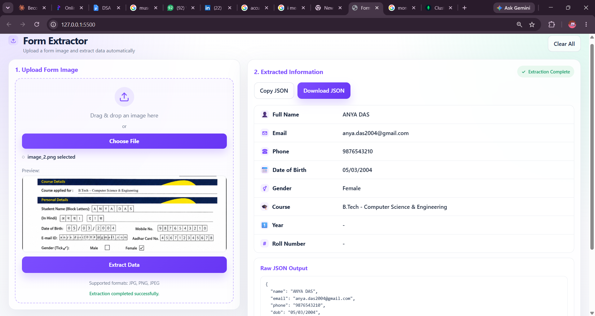

# AI Form Extractor

Upload a photo of a filled-out form and get back clean, structured data — no manual typing. Powered by Gemini's multimodal API, with every extraction automatically saved to a database.



## What It Does

- Upload or drag-and-drop a photo/scan of a filled form
- Gemini reads the image and extracts key fields as structured JSON
- Extracted data is displayed in a clean, labeled card view — plus raw JSON if you need it
- Every successful extraction is automatically saved to MongoDB
- Copy or download the extracted JSON with one click

## Tech Stack

- **Node.js + Express** — backend server
- **Multer** — handles image uploads
- **Google Gemini API** (`gemini-3.6-flash`) — reads the form image and extracts fields
- **MongoDB Atlas + Mongoose** — stores every extracted record
- **Plain HTML / CSS / JavaScript** — frontend, no framework

## Architecture
 
```
   Browser (index.html + script.js)
            │
            │  1. User selects/drops an image
            │  2. fetch() sends it as FormData (POST /extract)
            ▼
   Express server (server.js)
            │
            │  3. Multer saves the upload to disk temporarily
            │  4. Image is read + base64-encoded
            ▼
   Gemini API (gemini-3.6-flash)
            │
            │  5. Reads the image, extracts fields as JSON
            ▼
   Express server
            │
            │  6. Parses the JSON response
            │  7. Maps fields onto the Mongoose schema
            │  8. Saves the record to MongoDB
            ▼
   MongoDB Atlas (formentries collection)
            │
            │  9. Server responds with the saved record
            ▼
   Browser — renders field cards + raw JSON
```

## Running Locally

1. Clone the repo and install dependencies:
   ```bash
   npm install
   ```
2. Create a `.env` file in the root with:
   ```
   GEMINI_API_KEY=your_key_here
   MONGO_URI=your_mongodb_connection_string
   ```
3. Start the server:
   ```bash
   node server.js
   ```
4. Open `index.html` (e.g. via VS Code's Live Server) in your browser.


## Project Structure

```
form-extractor/
├── index.html         # markup
├── styles.css          # styling
├── script.js           # frontend logic (upload, fetch, render)
├── server.js           # Express server + Gemini + MongoDB logic
├── formSchema.js        # Mongoose schema for saved records
└── package.json
```

## Real-World Applications
 
This same extract-and-store pattern shows up in several practical settings:
 
- **College/school admin offices** — digitizing paper admission or registration forms instead of manual data entry
- **HR teams** — pulling structured candidate details from scanned application forms
- **Government service centers** — converting handwritten or printed forms into searchable digital records
- **Accounting/expense tracking** — the same pipeline works for receipts and invoices, extracting vendor, amount, and date instead of form fields

## Notes

Test data uses a synthetic mock admission form with fake information — no real personal data is used anywhere in this project.

Built as a solo project to learn multimodal AI API integration, backend file handling, and database persistence — from scratch, one debugged error at a time.